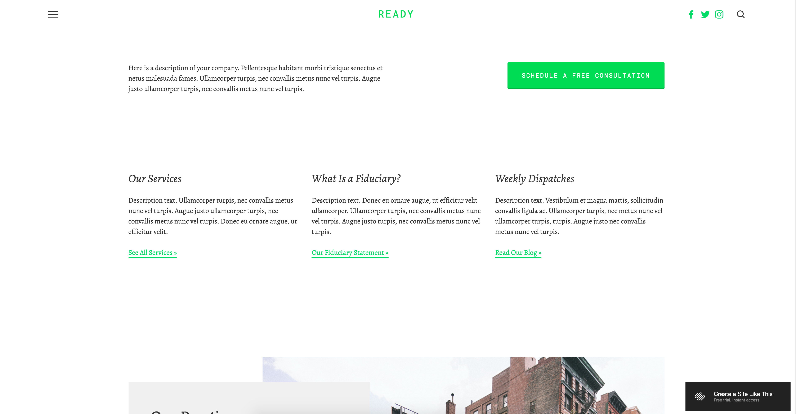
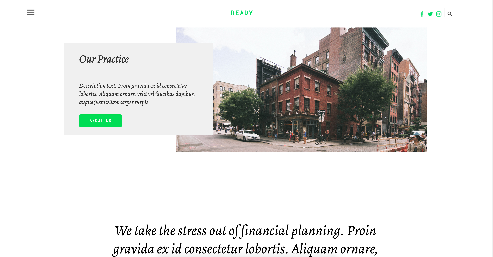

# Project-1
For __Project 1__  we were required to research, pick a website, and build an honest replica of it using __HTML__ and __CSS__.  
Additionally, the website should be *responsive* (meaning it looks good on mobile, tablet, and desktop).

I attempted to replicate [this webpage](https://ready-demo.squarespace.com/?nochrome=false).

## Completion  
For Project-1 I feel I did a very good job in replicating the exact look of the webpage.  
Additionally I was able to replicate the animations of the buttons as well as the header that tracks your movement down the page.  
The website is responsive. If the window becomes too small or is viewed on a phone the items change size 
to accomodate.

Below are photos to compare the original website to the website I created.

#### The original website  
  

#  
#  

#### My website  

#  
#  

#### The original website  
  

#  
#  

#### My website  

#
#

#### The original website  
  

#  
#  

#### My website  

#
#

#### The original website  
  

#  
#  

#### My website  
  

#

[Here is a link to my website.](https://tylereikenberg.github.io/Tyler-Eikenberg-Project-1/#)  
[Here is a link the the original website.](https://ready-demo.squarespace.com/?nochrome=false)

